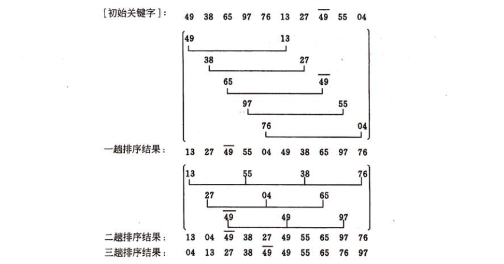
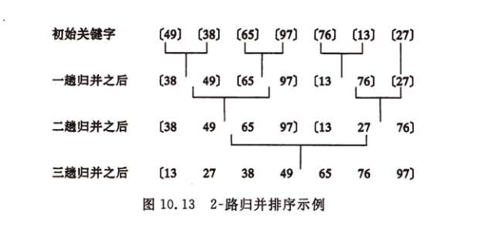
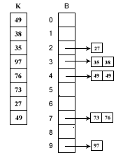
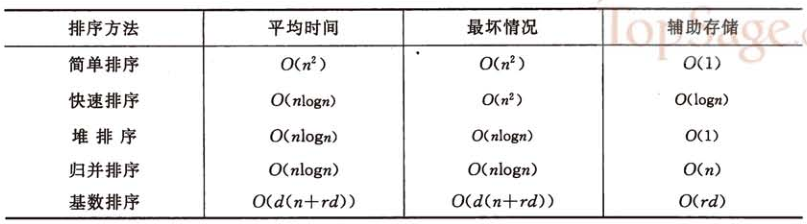
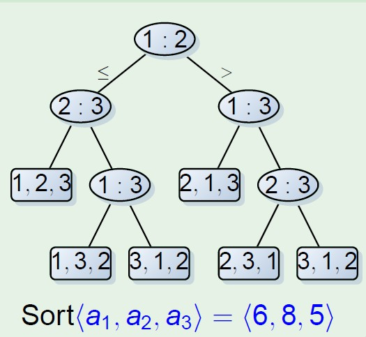

[Link](http://www.imooc.com/article/8633)

我们来分析一下常见的排序算法及其使用场景，在知道算法的原理后，还应该进一步理解算法的时空复杂度。

## 冒泡排序
冒泡排序其大体思想就是通过与相邻元素的比较和交换来把小的数交换到最前面。这个过程类似于水泡向上升一样，因此而得名。冒泡排序的时间复杂度为$O(n^{2})$
```python
def bubble_sort(nums):
    for i in range(len(nums)-1, -1, -1):
        for j in range(i):
            if nums[j] > nums[j+1]:
                nums[j], nums[j+1] = nums[j+1], nums[j]
```

## 选择排序
选择排序的思想其实和冒泡排序有点类似，都是在一次排序后把最小的元素放到最前面。但是过程不同，冒泡排序是通过相邻的比较和交换。而选择排序是通过对整体的选择。其实选择排序可以看成冒泡排序的优化，因为其目的相同，只是选择排序只有在确定了最小数的前提下才进行交换，大大减少了交换的次数。选择排序的时间复杂度为$O(n^{2})$。
```python
def select_sort(nums):
    for i in range(len(nums)):
        min_index = i
        for j in range(i+1, len(nums)):
            if nums[j] < nums[min_index]:
                min_index = j

        nums[i], nums[min_index] = nums[min_index], nums[i]
```
## 插入排序
插入排序不是通过交换位置而是通过比较找到合适的位置插入元素来达到排序的目的的。相信大家都有过打扑克牌的经历，特别是牌数较大的。在分牌时可能要整理自己的牌，牌多的时候怎么整理呢？就是拿到一张牌，找到一个合适的位置插入。这个原理其实和插入排序是一样的。注意在插入一个数的时候要保证这个数前面的数已经有序。简单插入排序的时间复杂度也是$O(n^{2})$。
```python
def insert_sort(nums):
    for i in range(1, len(nums)):
        for j in range(i):
            if nums[i] < nums[j]:
                tmp = nums[i]
                del nums[i]
                nums.insert(j, tmp)
```

## 快速排序
快速排序一听名字就觉得很高端，在实际应用当中快速排序确实也是表现最好的排序算法。快速排序虽然高端，但其实其思想是来自冒泡排序，冒泡排序是通过相邻元素的比较和交换把最小的冒泡到最顶端，而快速排序是比较和交换小数和大数，这样一来不仅把小数冒泡到上面同时也把大数沉到下面。
### 举个栗子：
对5,3,8,6,4这个无序序列进行快速排序，思路是右指针找比基准数小的，左指针找比基准数大的，交换之。 5,3,8,6,4 用5作为比较的基准，最终会把5小的移动到5的左边，比5大的移动到5的右边。 5,3,8,6,4 首先设置i,j两个指针分别指向两端，j指针先扫描,4比5小停止。然后i扫描，8比5大停止。交换i,j位置。 5,3,4,6,8 然后j指针再扫描，这时j扫描4时两指针相遇。停止。然后交换4和基准数。 4,3,5,6,8 一次划分后达到了左边比5小，右边比5大的目的。之后对左右子序列递归排序，最终得到有序序列。

快速排序是不稳定的，其时间平均时间复杂度是$O(nlgn)$。

```python
def partition(nums, left, right):
    pivot = left

    while left < right:
        while nums[right] > nums[pivot]:
            if right == 0:
                break
            right -= 1
        while nums[left] <= nums[pivot]:
            if left == len(nums) - 1:
                break
            left += 1
        nums[left], nums[right] = nums[right], nums[left]
    nums[left], nums[right] = nums[right], nums[left]
    nums[right], nums[pivot] = nums[pivot], nums[right]
    return right

def quick_sort(nums, left, right):
    if left >= right:
        return
    position = partition(nums, left, right)
    quick_sort(nums, left, position-1)
    quick_sort(nums, position+1, right)
```

## 希尔排序
希尔排序是插入排序的一种高效率的实现，也叫缩小增量排序。简单的插入排序中，如果待排序列是正序时，时间复杂度是$O(n)$，如果序列是基本有序的，使用直接插入排序效率就非常高。希尔排序就利用了这个特点。基本思想是：先将整个待排记录序列分割成为若干子序列分别进行直接插入排序，待整个序列中的记录基本有序时再对全体记录进行一次直接插入排序。


从上述排序过程可见，希尔排序的特点是，子序列的构成不是简单的逐段分割，而是将某个相隔某个增量的记录组成一个子序列。如上面的例子，第一堂排序时的增量为5，第二趟排序的增量为3。由于前两趟的插入排序中记录的关键字是和同一子序列中的前一个记录的关键字进行比较，因此关键字较小的记录就不是一步一步地向前挪动，而是跳跃式地往前移，从而使得进行最后一趟排序时，整个序列已经做到基本有序，只要作记录的少量比较和移动即可。因此希尔排序的效率要比直接插入排序高。

希尔排序的分析是复杂的，时间复杂度是所取增量的函数，这涉及一些数学上的难题。但是在大量实验的基础上推出当n在某个范围内时，时间复杂度可以达到$O(n^{1.3})$。

```python
def shell_insert(nums, d):
    for i in range(d):
        tmp = []
        j = i
        while j < len(nums):
            tmp.append(nums[j])
            j += d
        insert_sort(tmp)
        j = i
        k = 0
        while j < len(nums):
            nums[j] = tmp[k]
            j += d
            k += 1


def shell_sort(nums):
    d = len(nums) / 2
    while d:
        shell_insert(nums, d)
        d /= 2
```
## 堆排序
堆排序是借助堆来实现的选择排序，思想同简单的选择排序，以下以大顶堆为例。注意：如果想升序排序就使用大顶堆，反之使用小顶堆。原因是堆顶元素需要交换到序列尾部。 首先，实现堆排序需要解决两个问题：
1. 如何由一个无序序列键成一个堆？
2. 如何在输出堆顶元素之后，调整剩余元素成为一个新的堆？

第一个问题，可以直接使用线性数组来表示一个堆，由初始的无序序列建成一个堆就需要自底向上从第一个非叶元素开始挨个调整成一个堆。

第二个问题，怎么调整成堆？首先是将堆顶元素和最后一个元素交换。然后比较当前堆顶元素的左右孩子节点，因为除了当前的堆顶元素，左右孩子堆均满足条件，这时需要选择当前堆顶元素与左右孩子节点的较大者（大顶堆）交换，直至叶子节点。我们称这个自堆顶自叶子的调整成为筛选。


```python
def heap_adjust(nums, start, end):
    tmp = nums[start]

    i = 2*start+1 # the index of left child and right child is 2*i+1, 2*i+2
    while i < end:

        if nums[i] < nums[i+1]: # select the bigger child
            i += 1
        if tmp > nums[i]:
            break
        nums[start] = nums[i] # child => father
        # next
        start = i
        i = 2*i+1
    nums[start] = tmp

def heap_sort(nums):
    # construct heap
    for i in range(len(nums)/2, -1, -1):
        heap_adjust(nums, i, len(nums)-1)

    print nums
    # sort and adjust heap
    for i in range(len(nums)-1, -1, -1):
        nums[0], nums[i] = nums[i], nums[0]
        heap_adjust(nums, 0, i-1)
```


## 归并排序
归并排序使用了递归分治的思想，其基本思想是，先递归划分子问题，然后合并结果。把待排序列看成由两个有序的子序列，然后合并两个子序列，然后把子序列看成由两个有序序列。。。。。倒着来看，其实就是先两两合并，然后四四合并。。。最终形成有序序列。空间复杂度为$O(n)$，时间复杂度为$O(nlogn)$。

```python
def merge_sort(nums):
    if(len(nums) <= 1):
        return nums  
    left = merge_sort(nums[:len(nums)/2])
    right = merge_sort(nums[len(nums)/2:len(nums)])
    result = []
    while len(left) > 0 and len(right)> 0:
        if( left[0] > right[0]):  
            result.append(right.pop(0))  
        else:  
            result.append(left.pop(0))  

    if(len(left)>0):
        result.extend(merge_sort(left))  
    else:
        result.extend(merge_sort(right))  
    return result
```

## 计数排序
前面基于比较的排序的下限是$O(nlogn)￥。但是确实也有线性时间复杂度的排序，只不过有前提条件，就是待排序的数要满足一定的范围的整数，而且计数排序需要比较多的辅助空间。其基本思想是，用待排序的数作为计数数组的下标，统计每个数字的个数。然后依次输出即可得到有序序列。
```python
def count_sort(nums, max_):
    res = [0] * max_
    for i in nums:
        res[i] += 1
    j = 0
    for i in range(len(res)):
        while res[i]:
            nums[j] = i
            j += 1
            res[i] -= 1
```

## 桶排序
### 桶排序的基本思想：
假设有一组长度为N的待排关键字序列K[1….n]。首先将这个序列划分成M个的子区间(桶) 。然后基于某种映射函数 ，将待排序列的关键字k映射到第i个桶中(即桶数组B的下标 i) ，那么该关键字k就作为B[i]中的元素(每个桶B[i]都是一组大小为N/M的序列)。接着对每个桶B[i]中的所有元素进行比较排序(可以使用快排)。然后依次枚举输出B[0]….B[M]中的全部内容即是一个有序序列。bindex=f(key) 其中，bindex 为桶数组B的下标(即第bindex个桶), key为待排序列的关键字。桶排序之所以能够高效，其关键在于这个映射函数。
### 举个栗子：


桶排序利用函数的映射关系，减少了几乎所有的比较工作。实际上，桶排序的f(k)值的计算，其作用就相当于快排中划分，希尔排序中的子序列，归并排序中的子问题，已经把大量数据分割成了基本有序的数据块(桶)。然后只需要对桶中的少量数据做先进的比较排序即可。


桶排序的平均时间复杂度为线性的$O(N+C)$，其中$C=N*(logN-logM)$。如果相对于同样的N，桶数量M越大，其效率越高，最好的时间复杂度达到O(N)。 当然桶排序的空间复杂度 为$O(N+M)$，如果输入数据非常庞大，而桶的数量也非常多，则空间代价无疑是昂贵的。此外，桶排序是稳定的。
```python
def f(key, bucket_num):
    return key / bucket_num

def bucket_sort(nums, bucket_num):
    b = [[]] * bucket_num

    for i in nums:
        bindex = f(i, bucket_num)
        #b[bindex].append(i)    what's wrong?
        b[bindex] = b[bindex] + [i]

    for i in range(len(b)):
        quick_sort(b[i], 0, len(b[i])-1)
        #bubble_sort(b[i])
    k = 0
    for i in b:
        for j in i:
            nums[k] = j
            k += 1
```

## 基数排序

## 总结
在前面的介绍和分析中我们提到了冒泡排序、选择排序、插入排序三种简单的排序及其变种快速排序、堆排序、希尔排序三种比较高效的排序。后面我们又分析了基于分治递归思想的归并排序还有计数排序、桶排序、基数排序三种线性排序。我们可以知道排序算法要么简单有效，要么是利用简单排序的特点加以改进，要么是以空间换取时间在特定情况下的高效排序。但是这些排序方法都不是固定不变的，需要结合具体的需求和场景来选择甚至组合使用。才能达到高效稳定的目的。没有最好的排序，只有最适合的排序。

下面就总结一下排序算法的各自的使用场景和适用场合。

1. 从平均时间来看，快速排序是效率最高的，但快速排序在最坏情况下的时间性能不如堆排序和归并排序。而后者相比较的结果是，在n较大时归并排序使用时间较少，但使用辅助空间较多。
2. 上面说的简单排序包括除希尔排序之外的所有冒泡排序、插入排序、简单选择排序。其中直接插入排序最简单，但序列基本有序或者n较小时，直接插入排序是好的方法，因此常将它和其他的排序方法，如快速排序、归并排序等结合在一起使用。
3. 基数排序的时间复杂度也可以写成$O(d*n)$。因此它最使用于n值很大而关键字较小的的序列。若关键字也很大，而序列中大多数记录的最高关键字均不同，则亦可先按最高关键字不同，将序列分成若干小的子序列，而后进行直接插入排序。
4. 从方法的稳定性来比较，基数排序是稳定的内排方法，所有时间复杂度为$O(n^2)$的简单排序也是稳定的。但是快速排序、堆排序、希尔排序等时间性能较好的排序方法都是不稳定的。稳定性需要根据具体需求选择。
5. 上面的算法实现大多数是使用线性存储结构，像插入排序这种算法用链表实现更好，省去了移动元素的时间。具体的存储结构在具体的实现版本中也是不同的。

## 附：基于比较排序算法时间下限为O(nlogn)的证明：
基于比较排序下限的证明是通过决策树证明的，决策树的高度$Ω(nlgn)$，这样就得出了比较排序的下限。


首先要引入决策树。 首先决策树是一颗二叉树，每个节点表示元素之间一组可能的排序，它予以京进行的比较相一致，比较的结果是树的边。 先来说明一些二叉树的性质，令T是深度为d的二叉树，则T最多有2^片树叶。 具有L片树叶的二叉树的深度至少是logL。 所以，对n个元素排序的决策树必然有n!片树叶（因为n个数有n!种不同的大小关系），所以决策树的深度至少是$log(n!)$，即至少需要$log(n!)$次比较。 而 $log(n!)=logn+log(n-1)+log(n-2)+…+log2+log1 >=logn+log(n-1)+log(n-2)+…+log(n/2) >=(n/2)log(n/2) >=(n/2)logn-n/2 =O(nlogn)$ 所以只用到比较的排序算法最低时间复杂度是$O(nlogn)$。
